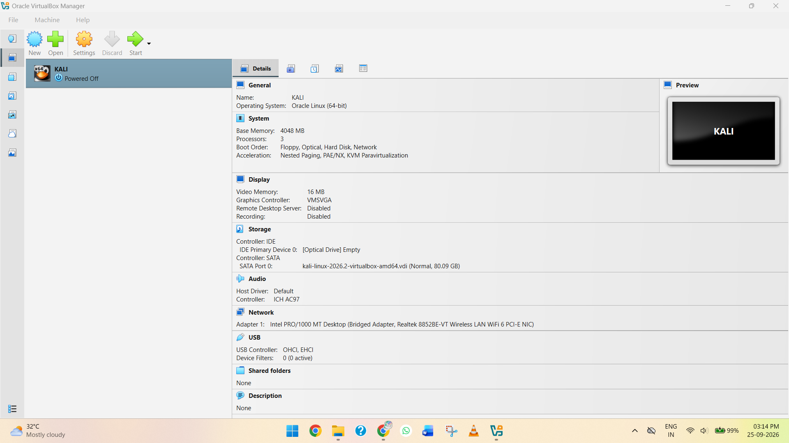
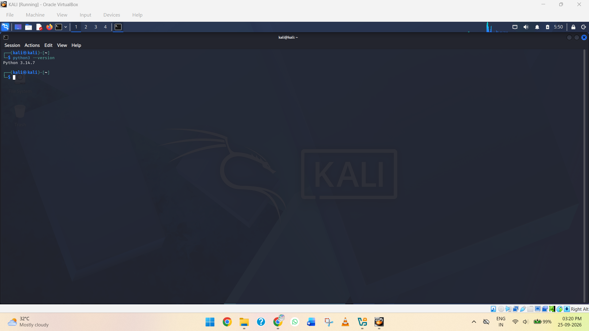
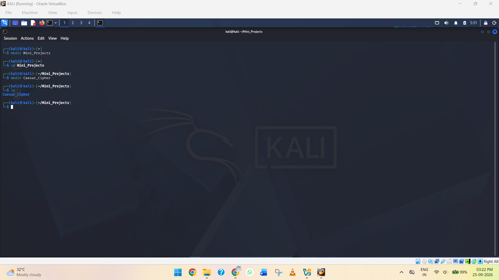
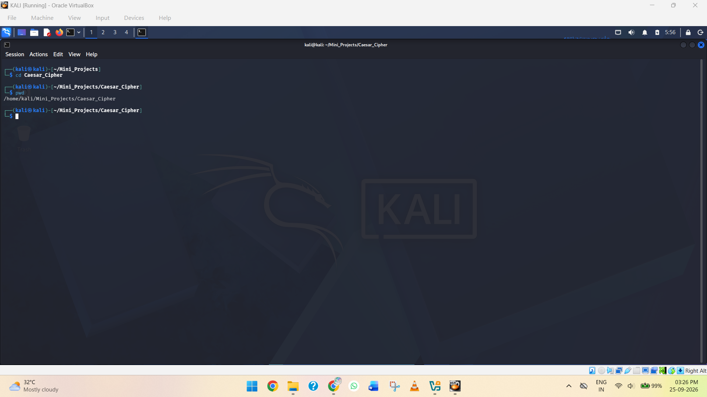
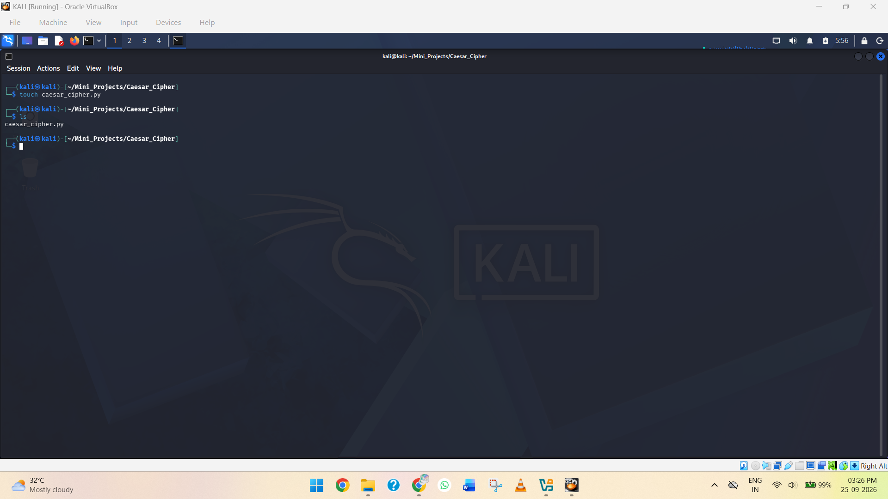
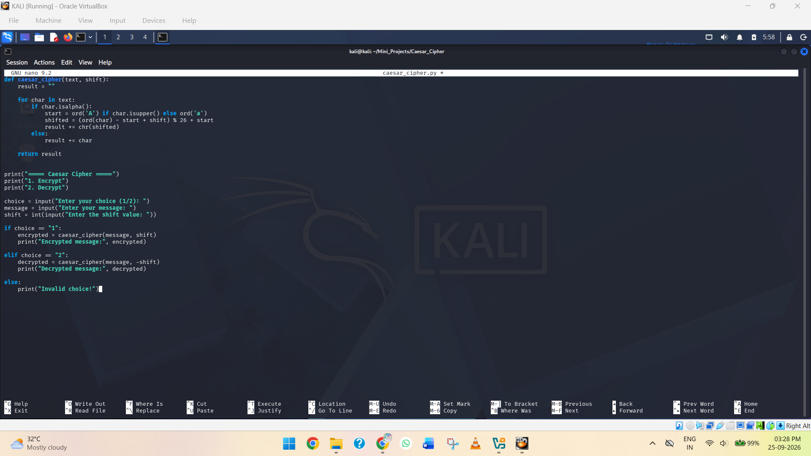
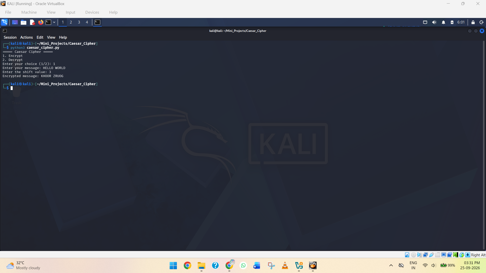
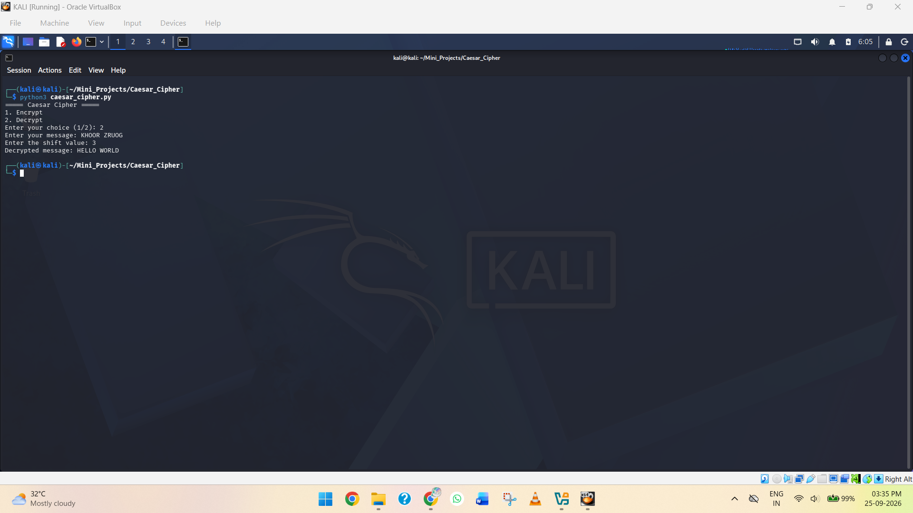
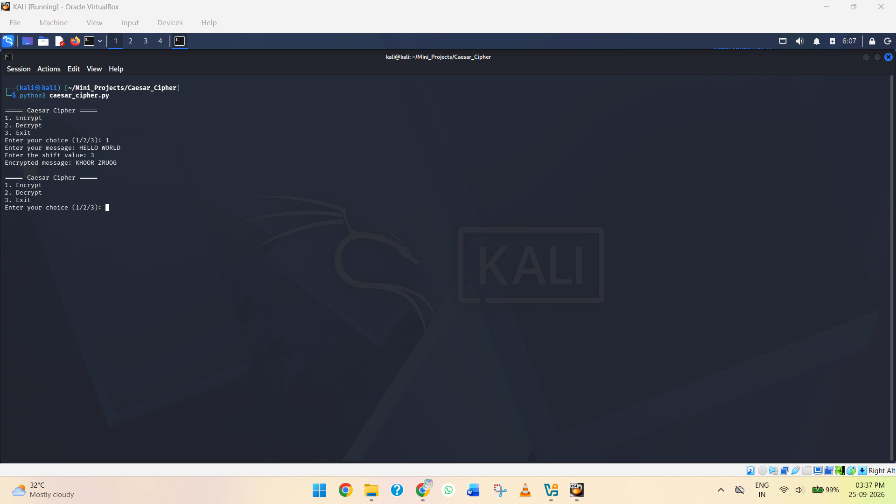
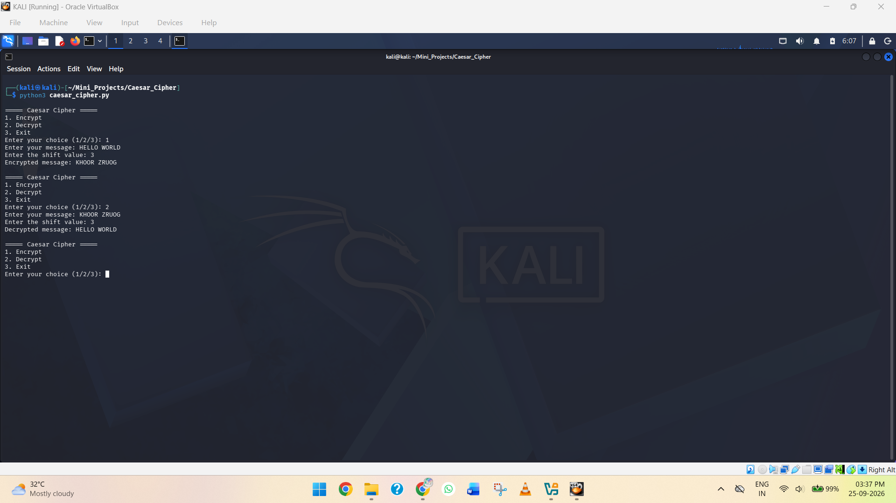

# Caesar Cipher Encryption and Decryption Using Python

## 📖 Project Overview

This project involves developing a Python-based Caesar Cipher program that allows users to encrypt and decrypt text using a user-defined shift value.

The program accepts a message and a shift value from the user. During encryption, each alphabetic character in the message is shifted by the specified number of positions. During decryption, the shift is reversed to recover the original message.

## 🎯 Project Objective

The main objectives of this project are:

- To understand the basic concept of the Caesar Cipher.
- To implement text encryption and decryption using Python.
- To accept the message and shift value from the user instead of hard-coding them.
- To handle both uppercase and lowercase letters.
- To preserve spaces, numbers, and special characters.
- To demonstrate a simple practical application of cryptography.

## 🛠️ Tools and Technologies

| Component | Details |
|---|---|
| Programming Language | Python 3 |
| Operating System | Kali Linux |
| Environment | VirtualBox |
| Encryption Algorithm | Caesar Cipher |
| Editor | Any Python-compatible text editor |
| Terminal | Kali Linux Terminal |

## ⚙️ Project Implementation

## Step 1: Prepare Kali Linux

**Objective:** Prepare the Kali Linux environment for the Caesar Cipher project. Python 3 is verified, a dedicated project directory is created, and the Python source file is initialized.

### 1. Open Kali Linux
Start the Kali Linux virtual machine in VirtualBox and log in to the system.


*Screenshot 1: Kali Linux set on VirtualBox.*

### 2. Open Terminal
Open the Kali Linux terminal.

### 3. Check Python Installation
Verify that Python 3 is installed and available on the system:

```bash
python3 --version
```

The command displays the installed Python 3 version.


*Screenshot 2: Python 3 version displayed in the terminal.*

### 4. Create the Project Folder
Create a dedicated folder for the project and navigate into it:

```bash
mkdir Mini_Projects
cd Mini_Projects
mkdir Caesar_Cipher
cd Caesar_Cipher
ls
```

These commands create the main `Mini_Projects` directory and a separate `Caesar_Cipher` directory for the project.


*Screenshot 3: Terminal showing the project directory creation and navigation.*

### 5. Verify the Current Location
Use the `pwd` command to verify the current working directory:

```bash
pwd
```


*Screenshot 4: Current project directory displayed using the pwd command.*

### 6. Create the Python Source File
Create the Python source file:

```bash
touch caesar_cipher.py
```

Verify that the file was created:

```bash
ls
```

The output should contain `caesar_cipher.py`.


*Screenshot 5: Terminal showing the newly created caesar_cipher.py file.*

**Result:** The Kali Linux environment has been successfully prepared for the project. Python 3 has been verified, the dedicated project directory has been created, and the `caesar_cipher.py` source file is ready for development.

## Step 2: Add Encrypt and Decrypt Options

**Objective:** Implement the Caesar Cipher encryption and decryption functionality in Python. The program allows the user to select either Encrypt or Decrypt, enter a message, and provide a shift value.

### 1. Open the Python File

```bash
nano caesar_cipher.py
```

### 2. Add the Caesar Cipher Program

```python
def caesar_cipher(text, shift):
    result = ""

    for char in text:
        if char.isalpha():
            start = ord('A') if char.isupper() else ord('a')
            shifted = (ord(char) - start + shift) % 26 + start
            result += chr(shifted)
        else:
            result += char

    return result


print("===== Caesar Cipher =====")
print("1. Encrypt")
print("2. Decrypt")

choice = input("Enter your choice (1/2): ")
message = input("Enter your message: ")
shift = int(input("Enter the shift value: "))

if choice == "1":
    encrypted = caesar_cipher(message, shift)
    print("Encrypted message:", encrypted)

elif choice == "2":
    decrypted = caesar_cipher(message, -shift)
    print("Decrypted message:", decrypted)

else:
    print("Invalid choice!")
```


*Screenshot 6: caesar_cipher.py opened in the Nano editor showing the completed Caesar Cipher code.*

### 3. Save the Python File
In Nano: `Ctrl + O`, `Enter`, `Ctrl + X`.

`Ctrl + O` saves the file, `Enter` confirms the filename, and `Ctrl + X` exits the Nano editor.

### 4. Test Encryption

```bash
python3 caesar_cipher.py
```

```
===== Caesar Cipher =====
1. Encrypt
2. Decrypt
Enter your choice (1/2): 1
Enter your message: HELLO
Enter the shift value: 3
Encrypted message: KHOOR
```


*Screenshot 7: Caesar Cipher program successfully encrypting HELLO WORLD with a shift value of 3.*

### 5. Test Decryption

```bash
python3 caesar_cipher.py
```

```
===== Caesar Cipher =====
1. Encrypt
2. Decrypt
Enter your choice (1/2): 2
Enter your message: KHOOR ZRUOG
Enter the shift value: 3
Decrypted message: HELLO WORLD
```


*Screenshot 8: Caesar Cipher program successfully decrypting KHOOR ZRUOG back to HELLO WORLD.*

### 6. Important Concept

The same `caesar_cipher()` function is used for both encryption and decryption.

**Encryption:**
```python
caesar_cipher(message, shift)
```
The positive shift moves each letter forward through the alphabet.
Example: `HELLO + 3 → KHOOR`

**Decryption:**
```python
caesar_cipher(message, -shift)
```
The negative shift moves each letter backward through the alphabet.
Example: `KHOOR - 3 → HELLO`

The use of a negative shift allows the same function to perform both operations, reducing the amount of code required.

**Result:** The Caesar Cipher program has been successfully implemented with separate Encrypt and Decrypt options. The program accepts a message and shift value from the user and correctly performs the selected operation while preserving spaces and other non-alphabetic characters.

## Step 3: Add Input Validation, Loop, and Exit Option

**Objective:** Improve the Caesar Cipher program by adding a continuous menu, an Exit option, and input validation. These improvements allow the user to perform multiple encryption or decryption operations without restarting the program and prevent the program from crashing when an invalid shift value is entered.

### 1. Open the Python File

```bash
nano caesar_cipher.py
```

### 2. Update the Python Program

```python
def caesar_cipher(text, shift):
    result = ""

    for char in text:
        if char.isalpha():
            start = ord('A') if char.isupper() else ord('a')
            shifted = (ord(char) - start + shift) % 26 + start
            result += chr(shifted)
        else:
            result += char

    return result


while True:
    print("\n===== Caesar Cipher =====")
    print("1. Encrypt")
    print("2. Decrypt")
    print("3. Exit")

    choice = input("Enter your choice (1/2/3): ")

    if choice == "3":
        print("Exiting Caesar Cipher...")
        break

    if choice not in ["1", "2"]:
        print("Invalid choice! Please select 1, 2, or 3.")
        continue

    message = input("Enter your message: ")

    try:
        shift = int(input("Enter the shift value: "))
    except ValueError:
        print("Invalid shift value! Please enter a number.")
        continue

    if choice == "1":
        encrypted = caesar_cipher(message, shift)
        print("Encrypted message:", encrypted)

    elif choice == "2":
        decrypted = caesar_cipher(message, -shift)
        print("Decrypted message:", decrypted)
```

### 3. Save the File
In Nano: `Ctrl + O`, `Enter`, `Ctrl + X`.

### 4. Run the Program

```bash
python3 caesar_cipher.py
```

```
===== Caesar Cipher =====
1. Encrypt
2. Decrypt
3. Exit
Enter your choice (1/2/3):
```

### 5. Test Encryption

```
Enter your choice (1/2/3): 1
Enter your message: HELLO WORLD
Enter the shift value: 3
Encrypted message: KHOOR ZRUOG
```

After displaying the encrypted message, the program returns to the main menu.


*Screenshot 9: Successful encryption of HELLO WORLD using a shift value of 3 and return to the main menu.*

### 6. Test Decryption

```
Enter your choice (1/2/3): 2
Enter your message: KHOOR ZRUOG
Enter the shift value: 3
Decrypted message: HELLO WORLD
```

The program then returns to the main menu.


*Screenshot 10: Successful decryption of KHOOR ZRUOG back to HELLO WORLD.*

### 7. Test the Exit Option

```
Enter your choice (1/2/3): 3
Exiting Caesar Cipher...
```

The program terminates.


*Screenshot 11: Program exiting successfully after selecting option 3.*

### What Was Added

**Continuous Execution**

```python
while True:
```

This keeps the Caesar Cipher program running and allows the user to perform multiple operations without restarting the program.

**Exit Option**

```python
if choice == "3":
    print("Exiting Caesar Cipher...")
    break
```

The `break` statement stops the `while` loop and terminates the program.

**Invalid Menu Handling**

```python
if choice not in ["1", "2"]:
    print("Invalid choice! Please select 1, 2, or 3.")
    continue
```

If the user enters an invalid option, the program displays an error message and returns to the menu.

**Invalid Shift Handling**

```python
try:
    shift = int(input("Enter the shift value: "))
except ValueError:
    print("Invalid shift value! Please enter a number.")
    continue
```

This prevents the program from crashing if the user enters non-numeric input such as `abc`. Instead, the program displays an appropriate error message and returns to the menu.

**Result:** The Caesar Cipher program has been enhanced with continuous execution, menu validation, shift-value validation, and an Exit option. The user can now perform multiple encryption and decryption operations within a single program session while invalid inputs are handled safely.

## ✅ Conclusion

This project successfully demonstrates the design and implementation of a Caesar Cipher encryption and decryption tool using Python on a Kali Linux environment. Starting from environment setup and basic implementation, the program was progressively improved to include a user-friendly menu, robust input validation, and an exit option, resulting in a stable and reusable command-line application.

Through this project, the core concepts of classical cryptography were applied practically, including character shifting, case handling, and preservation of non-alphabetic characters. The use of a single reversible function for both encryption and decryption highlights an efficient approach to solving a two-way problem with minimal code duplication.

Overall, the Caesar Cipher project provided hands-on experience with Python fundamentals such as functions, loops, conditional logic, exception handling, and user input processing, while also reinforcing basic cybersecurity concepts relevant to encryption and decryption techniques.

