# Pixel Manipulation for Image Encryption

## 📖 Project Overview

The **Pixel Manipulation for Image Encryption** project is a Python-based image encryption and decryption application that uses basic pixel manipulation techniques. The program uses the **Pillow** library to read an image, access its individual RGB pixel values, modify those values using an encryption key, and save the resulting image.

The project supports both encryption and decryption. During encryption, the specified key is added to each RGB component of every pixel. During decryption, the same key is subtracted from each RGB component to restore the original pixel values.

This project demonstrates how image data can be processed at the pixel level and provides a practical introduction to basic image encryption concepts using Python.

---

## 🎯 Project Objective

The main objectives of this project are:

* To understand how digital images are represented using pixels and RGB values.
* To learn how Python can be used to read and manipulate image data.
* To implement a basic image encryption technique using pixel manipulation.
* To implement a corresponding decryption process.
* To understand how an encryption key can be used to modify pixel values.
* To verify that the encrypted image can be restored using the same key.
* To gain practical experience with the Python Pillow library.
* To develop a simple command-line based image encryption and decryption tool.

---

## 🛠️ Tools and Technologies

| Tool / Technology          | Purpose                                                                   |
| -------------------------- | ------------------------------------------------------------------------- |
| **Kali Linux**             | Operating system used for the project environment                         |
| **VirtualBox**             | Used to run the Kali Linux virtual machine                                |
| **Python 3.14.6**          | Programming language used to develop the application                      |
| **Pillow**                 | Python library used for image processing and pixel manipulation           |
| **Nano**                   | Terminal-based text editor used to create and edit the Python program     |
| **Terminal**               | Used to execute commands and run the application                          |
| **GitHub**                 | Used to store and document the project                                    |
| **RGB Pixel Manipulation** | Technique used to modify image pixel values for encryption and decryption |

---

## ⚙️ Project Implementation

## Step 1 — Prepare Kali Linux

### Objective

Prepare the Kali Linux environment for the **Pixel Manipulation for Image Encryption** project by verifying the Python installation, creating a dedicated project directory, and confirming the current working location.

### 1. Open Kali Linux

Start the **Kali Linux virtual machine** in VirtualBox and log in to the system.


**Screenshot 1: Kali Linux running in VirtualBox**

### 2. Open Terminal

Open the Kali Linux terminal using the keyboard shortcut:

```text
Ctrl + Alt + T
```

### 3. Check Python Installation

Verify that Python 3 is installed and available on the system by running:

```bash
python3 --version
```

The command displays the installed Python 3 version.

In this project, the installed version is:

```text
Python 3.14.6
```

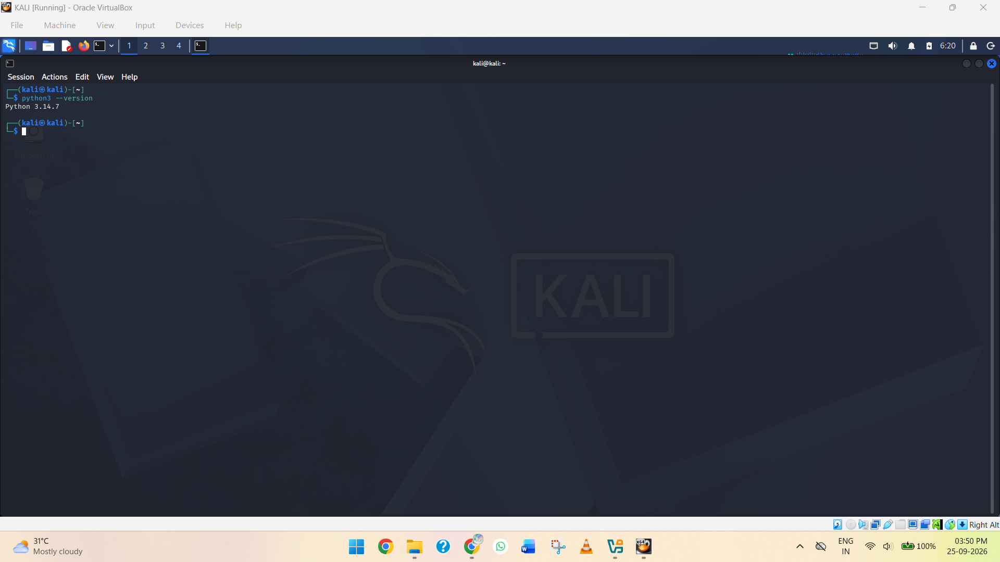

*Screenshot 2: Python 3 version displayed in the terminal*

### 4. Create the Project Folder

Create a dedicated folder for the project and navigate into it using the following commands:

```bash
mkdir Pixel_Manipulation
cd Pixel_Manipulation
ls
```

These commands create a separate `Task_02_Pixel_Manipulation` directory and make it the current working directory for the project.

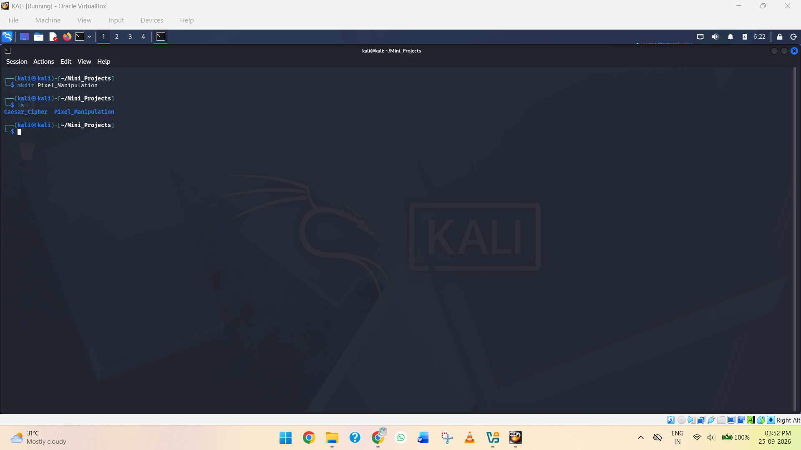

**Screenshot 3: Terminal showing the project directory creation and navigation**

### 5. Verify the Current Location

Use the `pwd` command to verify the current working directory:

```bash
pwd
```

The terminal should display the path of the newly created `Task_02_Pixel_Manipulation` directory.

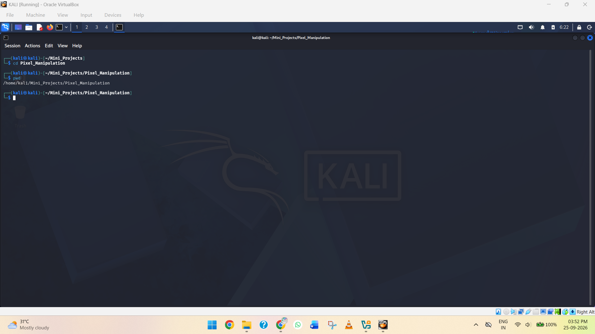

**Screenshot 4: Current project directory displayed using the pwd command**

### Result

The Kali Linux environment has been prepared successfully. Python 3.14.6 was verified, the `Task_02_Pixel_Manipulation` project directory was created, and the terminal was positioned inside the project directory. The environment is now ready for the next stage of the image encryption project.

## Step 2 — Install and Verify Pillow

### Objective

Install the **Pillow** Python library, which will be used to open, read, manipulate, and save image files during the encryption and decryption process.

### 1. Check if Pillow is Installed

From inside the project directory, run:

```bash
python3 -c "from PIL import Image; print('Pillow is installed')"
```

If Pillow is already installed, the terminal will display:

```text
Pillow is installed
```

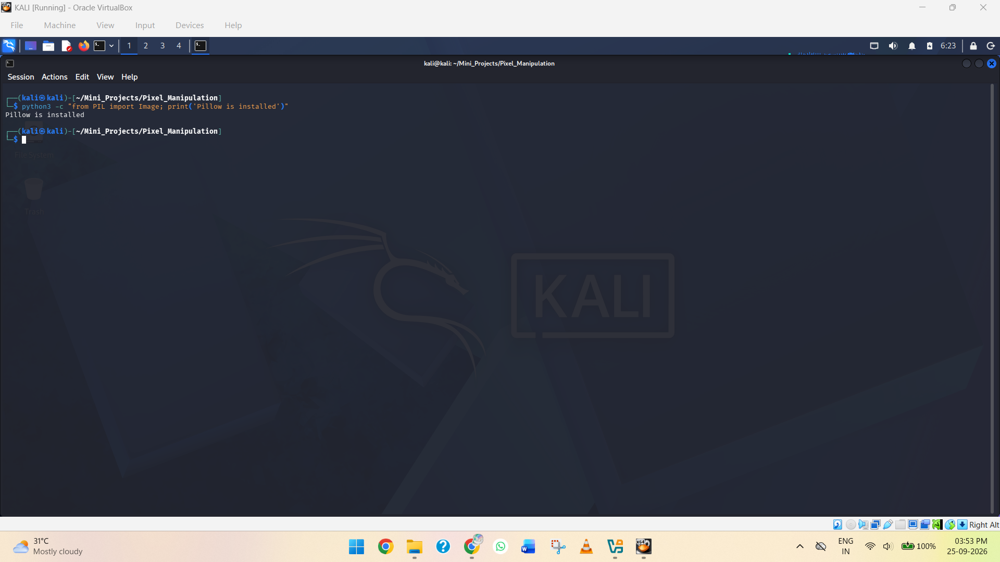

**Screenshot 5: Showing Pillow is already installed**

If you get an error such as:

```text
ModuleNotFoundError: No module named 'PIL'
```

continue with the installation below.

### 2. Install Pillow

Run:

```bash
python3 -m pip install Pillow
```

After the installation completes, verify it again:

```bash
python3 -c "from PIL import Image; print('Pillow is installed successfully')"
```

The terminal should display:

```text
Pillow is installed successfully
```

### 3. Verify the Pillow Version

Run:

```bash
python3 -c "import PIL; print(PIL.__version__)"
```

This command displays the installed Pillow version.

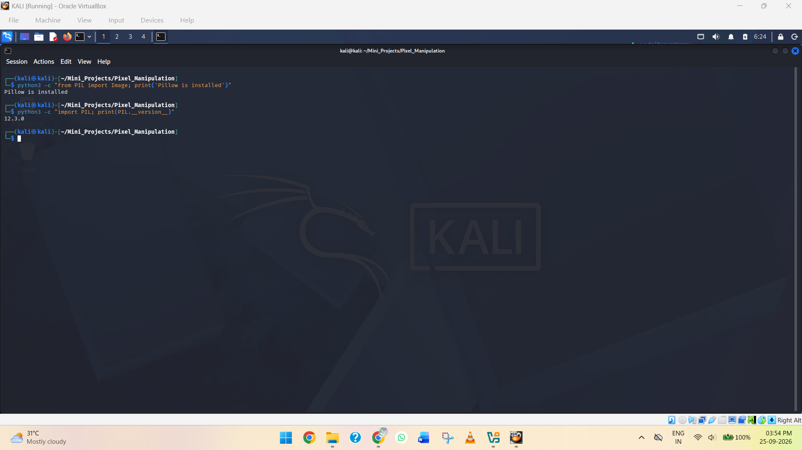

**Screenshot 6: Showing Pillow version**

### Result

The Pillow library was successfully installed and verified in the Kali Linux environment. Pillow will provide the image-processing functionality required to read image pixels, modify their RGB values, and create encrypted and decrypted image files.

## Step 3 — Create the Python Program

### Objective

Create the main Python file for the **Pixel Manipulation for Image Encryption** project. This file will contain the functions required to read an image, manipulate its pixel values, and later encrypt and decrypt the image.

### 1. Create the Python File

Make sure you are inside the project directory.

Create the Python file using:

```bash
nano pixel_manipulation.py
```

This opens the Nano text editor and creates a new Python file named `image_manipulation.py`.

### 2. Add the Basic Python Structure

For now, enter the following code:

```python
from PIL import Image


def encrypt_image(input_path, output_path, key):
    print("Encryption function created")


def decrypt_image(input_path, output_path, key):
    print("Decryption function created")


def main():
    print("Pixel Manipulation for Image Encryption")
    print("Program initialized successfully")


if __name__ == "__main__":
    main()
```

At this stage, the program only creates the basic structure. The actual pixel manipulation will be added in the following steps.

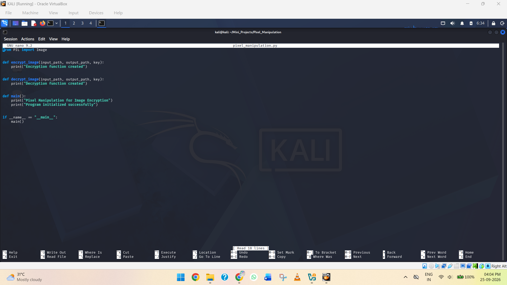

**Screenshot 7: Showing the Python code**

### 3. Save the File

In Nano:

```text
Ctrl + O
```

Press **Enter** to confirm the filename.

Then exit Nano:

```text
Ctrl + X
```

### 4. Verify the Python File

Run:

```bash
ls
```

The terminal should show:

```text
pixel_manipulation.py
```

### 5. Run the Program

Execute the Python program:

```bash
python3 pixel_manipulation.py
```

You should see:

```text
Pixel Manipulation for Image Encryption
Program initialized successfully
```
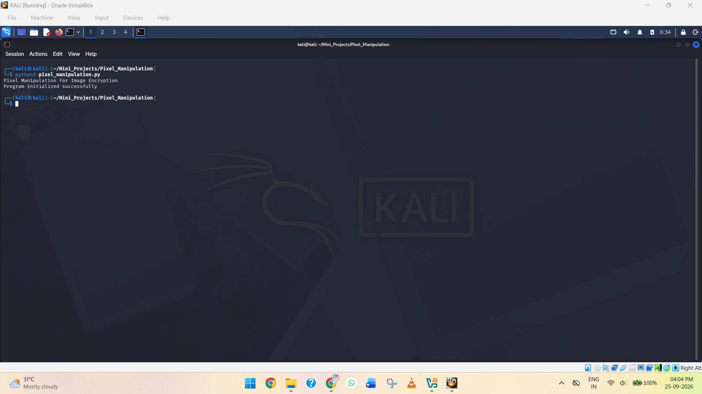

**Screenshot 8: Python program created and successfully executed**

### Result

The main Python program file `pixel_manipulation.py` was successfully created and executed. The basic program structure, including separate encryption and decryption functions, is now ready for implementing the pixel manipulation logic.

## Step 4 — Add Image Input and Key

### Objective

Modify the Python program to allow the user to enter the **image file path** and an **encryption key** instead of using hard-coded values. This will make the program interactive and prepare it for the pixel manipulation process.

### 1. Open the Python File

From the project directory, run:

```bash
nano pixel_manipulation.py
```

### 2. Replace the Existing Code

Replace the existing code with:

```python
from PIL import Image


def encrypt_image(input_path, output_path, key):
    print("Encryption function created")


def decrypt_image(input_path, output_path, key):
    print("Decryption function created")


def main():
    print("Pixel Manipulation for Image Encryption")
    print("---------------------------------------")

    input_path = input("Enter the image file path: ")
    key = int(input("Enter the encryption key: "))

    print("\nImage:", input_path)
    print("Encryption Key:", key)


if __name__ == "__main__":
    main()
```

The program now accepts the **image path** and **encryption key** from the user.

### 3. Save the File

In Nano:

```text
Ctrl + O
```

Press **Enter** to save the file.

Then exit Nano:

```text
Ctrl + X
```

### 4. Verify the Python File

Run:

```bash
ls
```

The terminal should show:

```text
pixel_manipulation.py
```

### 5. Add an Image for Testing

Download or select an image that will be used as the test image for the project.

In this project, the image is stored inside:

```text
~/Mini_Projects/Pixel_Manipulation/Images/Test
```

Verify the image using:

```bash
cd Images/Test
lsw
```

The terminal should display the name of the test image.

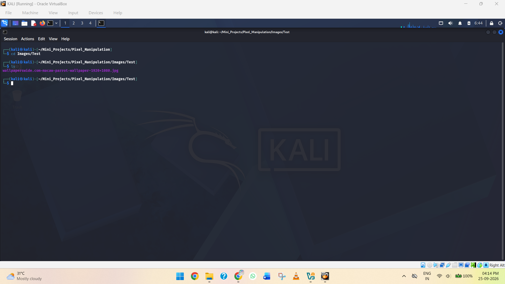

**Screenshot 9: Test image stored inside the Images folder**

### 6. Run the Program

Execute the Python program:

```bash
python3 pixel_manipulation.py
```

The program will display:

```text
Pixel Manipulation for Image Encryption
---------------------------------------
Enter the image file path:
```

Enter the path of the test image. For example:

```text
Images/Test/wallpaperswide.com-macaw-parrot-wallpaper-1920x1080.jpg
```

The program will then ask for the encryption key:

```text
Enter the encryption key: 50
```

The program should display:

```text
Image: Images/Test/wallpaperswide.com-macaw-parrot-wallpaper-1920x1080.jpg
Encryption Key: 50
```

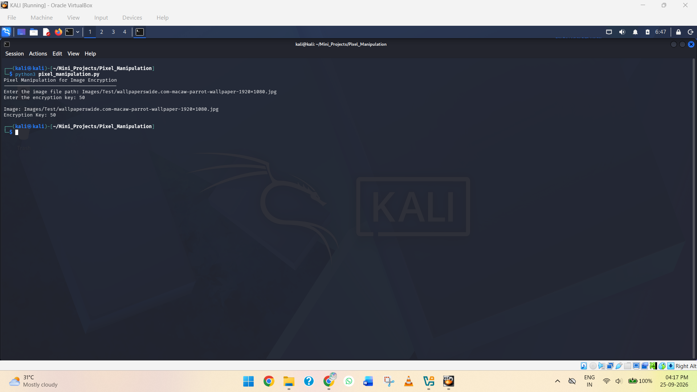

**Screenshot 10: Program accepting the image path and encryption key from the user**

### Result

The main Python program was successfully created, a test image was added to the project, and the program was tested with the image path and encryption key as user inputs. The project is now ready for implementing the actual pixel manipulation and image encryption logic.

## Step 5 — Read and Manipulate Image Pixels

### Objective

Modify the Python program to open the input image and access its individual pixel values. This step introduces the core concept of **pixel manipulation**, which will be used to create the image encryption and decryption process.

### 1. Open the Python File

From the project directory,

Open the Python file:

```bash
nano pixel_manipulation.py
```

### 2. Replace the Existing Code

Replace the existing code with:

```python
from PIL import Image


def encrypt_image(input_path, output_path, key):
    image = Image.open(input_path)
    pixels = image.load()

    for x in range(image.width):
        for y in range(image.height):
            r, g, b = pixels[x, y]

            r = (r + key) % 256
            g = (g + key) % 256
            b = (b + key) % 256

            pixels[x, y] = (r, g, b)

    image.save(output_path)
    print("Image encrypted successfully")


def decrypt_image(input_path, output_path, key):
    image = Image.open(input_path)
    pixels = image.load()

    for x in range(image.width):
        for y in range(image.height):
            r, g, b = pixels[x, y]

            r = (r - key) % 256
            g = (g - key) % 256
            b = (b - key) % 256

            pixels[x, y] = (r, g, b)

    image.save(output_path)
    print("Image decrypted successfully")


def main():
    print("Pixel Manipulation for Image Encryption")
    print("---------------------------------------")

    input_path = input("Enter the image file path: ")
    key = int(input("Enter the encryption key: "))

    print("\nImage:", input_path)
    print("Encryption Key:", key)


if __name__ == "__main__":
    main()
```

### 3. Understand the Pixel Operation

Each image pixel contains color values represented as:

```text
(R, G, B)
```

For example:

```text
(100, 150, 200)
```

During encryption, the program adds the key to each RGB value:

```text
R = (R + key) % 256
G = (G + key) % 256
B = (B + key) % 256
```

If the key is `50`:

```text
(100, 150, 200)
        ↓
(150, 200, 250)
```

The `% 256` operation keeps every RGB value within the valid range of **0–255**.

During decryption, the program performs the reverse operation:

```text
R = (R - key) % 256
G = (G - key) % 256
B = (B - key) % 256
```

This allows the original pixel values to be recovered when the same key is used.

### 4. Save the File

In Nano:

```text
Ctrl + O
```

Press **Enter** to save the file.

Then exit Nano:

```text
Ctrl + X
```

### 5. Check the Program for Errors

Run:

```bash
python3 -m py_compile pixel_manipulation.py
```

If there are no syntax errors, the command will return to the terminal without displaying an error message.

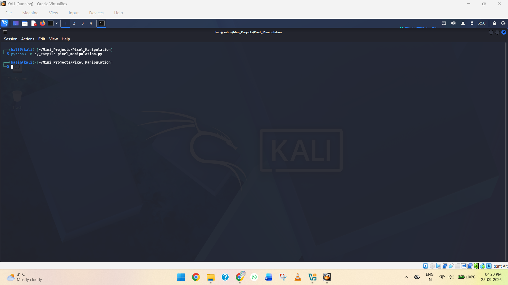

**Screenshot 11: Python program showing no errors.

### Result

The program was updated to read the image pixels and perform mathematical manipulation on their RGB values. Encryption adds the specified key to each RGB component, while decryption subtracts the same key to restore the original values. The core pixel manipulation logic required for the image encryption process has now been implemented.

## Step 6 — Add Encryption and Decryption Options

### Objective

Modify the program to allow the user to choose between **encryption** and **decryption**. The program will use the selected operation, input image, encryption key, and output path to generate the corresponding image.

### 1. Open the Python File

From the project directory,

Open the Python file:

```bash id="x0f6kv"
nano pixel_manipulation.py
```

### 2. Update the `main()` Function

Keep the existing `encrypt_image()` and `decrypt_image()` functions from the previous step.

Replace the existing `main()` function with:

```python id="7v0g8m"
def main():
    print("Pixel Manipulation for Image Encryption")
    print("---------------------------------------")

    print("1. Encrypt Image")
    print("2. Decrypt Image")

    choice = input("Enter your choice (1/2): ")
    input_path = input("Enter the image file path: ")
    key = int(input("Enter the encryption key: "))
    output_path = input("Enter the output image path: ")

    if choice == "1":
        encrypt_image(input_path, output_path, key)

    elif choice == "2":
        decrypt_image(input_path, output_path, key)

    else:
        print("Invalid choice. Please select 1 or 2.")
```

Make sure the bottom of the program still contains:

```python id="0x9e5p3"
if __name__ == "__main__":
    main()
```

The updated program now provides two options:

```text id="2s8g4h"
1. Encrypt Image
2. Decrypt Image
```

The user can select the required operation and provide the input image path, encryption key, and output image path.

### 3. Save the File

In Nano:

```text id="v9v1v6"
Ctrl + O
```

Press **Enter** to save the file.

Then exit Nano:

```text id="z7q4cx"
Ctrl + X
```

### Result

The program now provides separate options for **image encryption** and **image decryption**. Based on the user's selection, the corresponding function is called using the specified image path, encryption key, and output path. The program is now ready to perform the complete encryption and decryption process.

## Step 7 — Encrypt the Image

### Objective

Modify and execute the Python program to encrypt the test image by manipulating the RGB values of each pixel. The encrypted image will be saved as a separate file inside the `Images/Output` directory, while the original image remains unchanged.

### 1. Create the Output Directory

Before running the encryption process, create a separate directory to store the generated output images:

```bash
mkdir -p Images/Output
```

The `-p` option creates the directory if it does not already exist.

Verify the directory:

```bash
ls Images
```

The terminal should display the `Output` directory along with the original image.

### 2. Run the Python Program

Execute the image encryption program:

```bash
python3 pixel_manipulation.py
```

The program will display:

```text
Pixel Manipulation for Image Encryption
---------------------------------------
1. Encrypt Image
2. Decrypt Image
Enter your choice (1/2):
```

Select the encryption option:

```text
1
```

### 3. Provide the Input Image

Enter the path of the test image:

```text
Images/Test/wallpaperswide.com-macaw-parrot-wallpaper-1920x1080.jpg
```

Then enter the encryption key:

```text
150
```

The encryption key is used to modify the RGB values of each pixel.

### 4. Specify the Output Image

When the program asks for the output image path, provide a filename with an appropriate image extension:

```text
Images/Output/encrypted_image.png
```

The complete input should look like:

```text
Enter your choice (1/2): 1

Enter the image file path: Images/Test/wallpaperswide.com-macaw-parrot-wallpaper-1920x1080.jpg

Enter the encryption key: 150

Enter the output image path: Images/Output/encrypted_image.png
```

The program should display:

```text
Image encrypted successfully
```

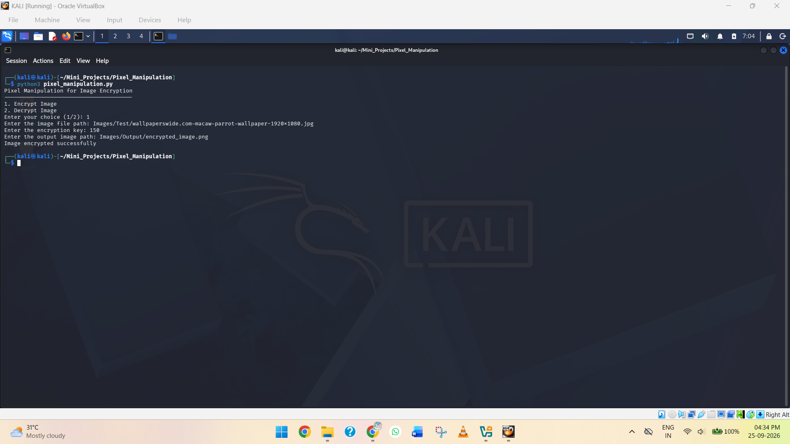

**Screenshot 12: Image encryption completed successfully**

### 5. Verify the Encrypted Image

Verify that the encrypted image was created successfully by running:

```bash
ls Images/Output
```

The terminal should display:

```text
encrypted_image.png
```

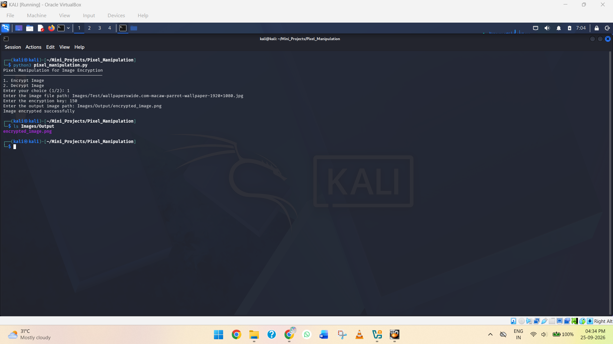

**Screenshot 13: Images/Output directory showing the generated encrypted image**

### 6. View the Encrypted Image

Open the `Images/Output` folder using the Kali Linux file manager and open `encrypted_image.png`.

The image should appear visually different from the original image because the RGB values of its pixels have been modified.

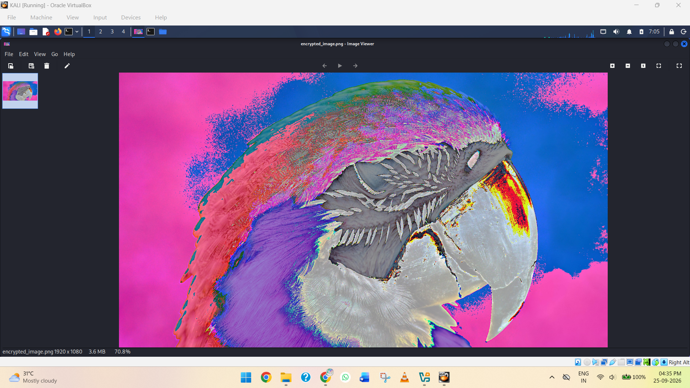

**Screenshot 14: Encrypted image displayed in the image viewer**

### Result

The test image was successfully encrypted using the pixel manipulation technique. The program modified the RGB values of each pixel using the specified encryption key and saved the resulting image as `encrypted_image.png` inside the `Images/Output` directory. The original image remained unchanged and can be used later to verify the decryption process.

## Step 8 — Decrypt the Image

### Objective

Use the encrypted image and the same encryption key to reverse the pixel manipulation and restore the image to its original pixel values. The decrypted image will be saved as a separate file so that it can be compared with the original image.

### 1. Run the Python Program

From the project directory, execute:

```bash
python3 pixel_manipulation.py
```

The program will display:

```
Pixel Manipulation for Image Encryption
---------------------------------------
1. Encrypt Image
2. Decrypt Image
Enter your choice (1/2):
```

Select the decryption option:

```
2
```

### 2. Provide the Encrypted Image

Enter the path of the encrypted image created during the encryption process:

```
Images/Output/encrypted_image.png
```

### 3. Enter the Same Encryption Key

Enter the same key used during encryption:

```
150
```

Using the same key is important because the decryption process subtracts this value from each RGB component to reverse the encryption operation.

### 4. Specify the Decrypted Image Path

Enter:

```text
Images/Output/decrypted_image.png
```

The complete input should look like:

```
Enter your choice (1/2): 2

Enter the image file path: Images/Output/encrypted_image.png

Enter the encryption key: 150

Enter the output image path: Images/Output/decrypted_image.png
```

The program should display:

```
Image decrypted successfully
```

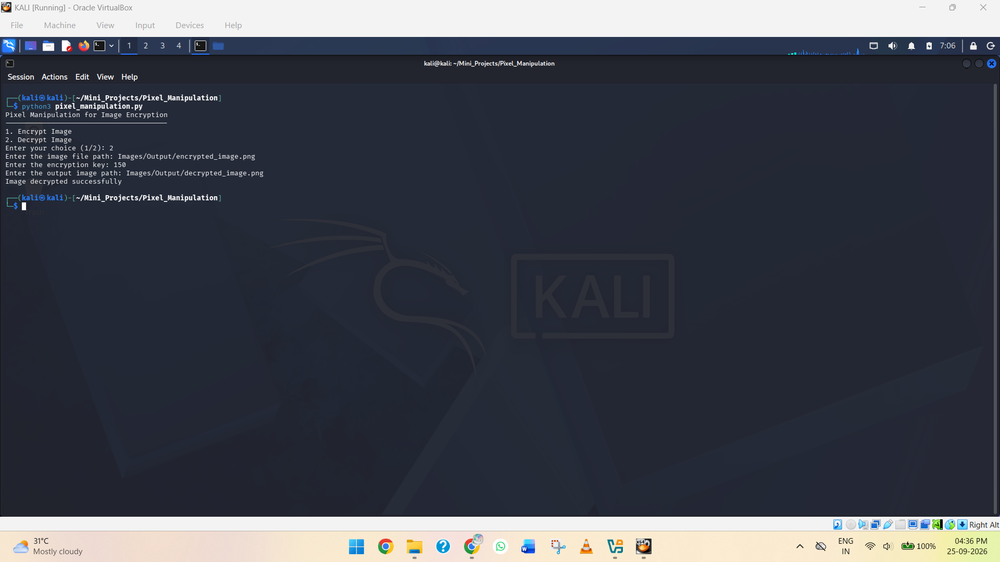

**Screenshot 15: Decryption process completed successfully**

### 5. Verify the Decrypted Image

Run:

```bash 
ls Images/Output
```

The terminal should display:

```
encrypted_image.png
decrypted_image.png
```

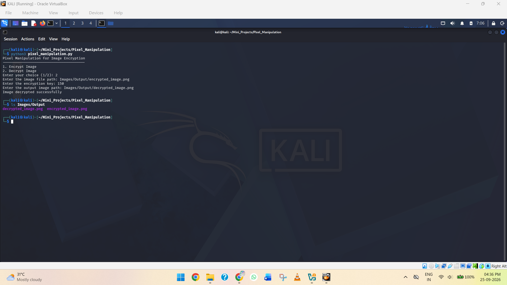

**Screenshot 16: Images/Output directory showing both encrypted and decrypted images**

### 6. View the Decrypted Image

Open the `Images/Output` directory and open:

```
decrypted_image.png
```

Compare it with the original image:

```
Images/wallpaperswide.com-macaw-parrot-wallpaper-1920x1080.jpg
```

The decrypted image should visually match the original image because the pixel manipulation has been reversed.

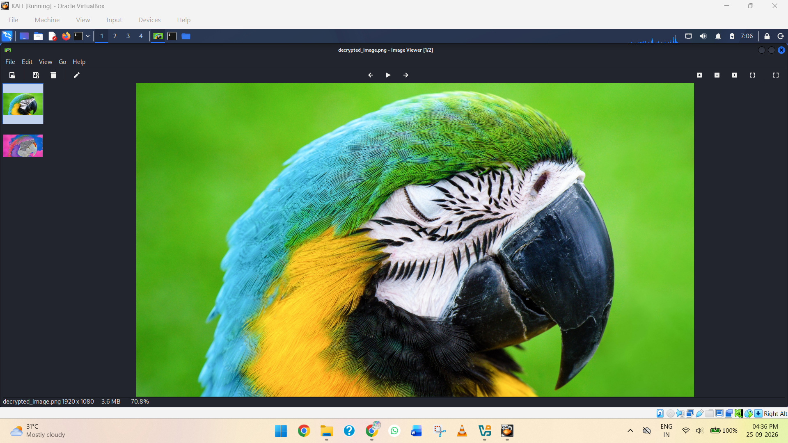

**Screenshot 17: Decrypted image displayed**

### 7. Compare the Decrypted Image with the Original

Compare the decrypted image with the original test image to verify that the encryption and decryption process correctly restores the image.

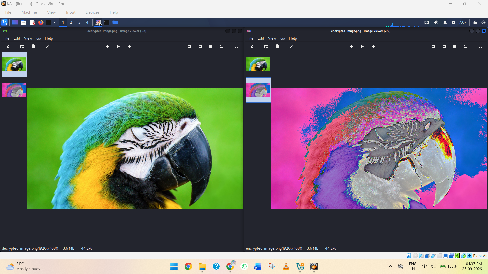

**Screenshot 18: Comparison of the original and decrypted images**

### Result

The encrypted image was successfully decrypted using the same encryption key. The program reversed the RGB pixel manipulation and generated `decrypted_image.png`. The decrypted image can now be compared with the original image to verify that the encryption and decryption process works correctly.

## ✅ Conclusion

The **Pixel Manipulation for Image Encryption** project was successfully completed using Python and the Pillow library. The project demonstrated how an image can be opened, its individual RGB pixel values accessed, and those values modified using a user-defined encryption key.

The application was implemented with both **encryption and decryption functionality**. During encryption, the RGB values were modified using the specified key, producing an encrypted image. During decryption, the same key was used to reverse the pixel manipulation and generate a decrypted image.

The decrypted image was then compared with the original image to verify the result. Through this project, practical knowledge was gained in **Python programming, image processing, pixel manipulation, basic encryption concepts, command-line application development, and the use of the Pillow library**.

