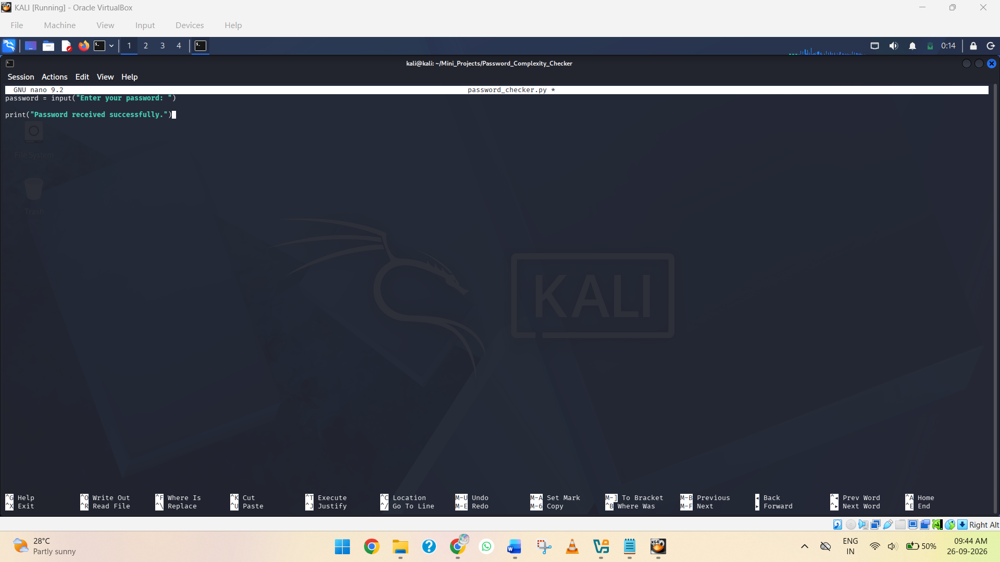
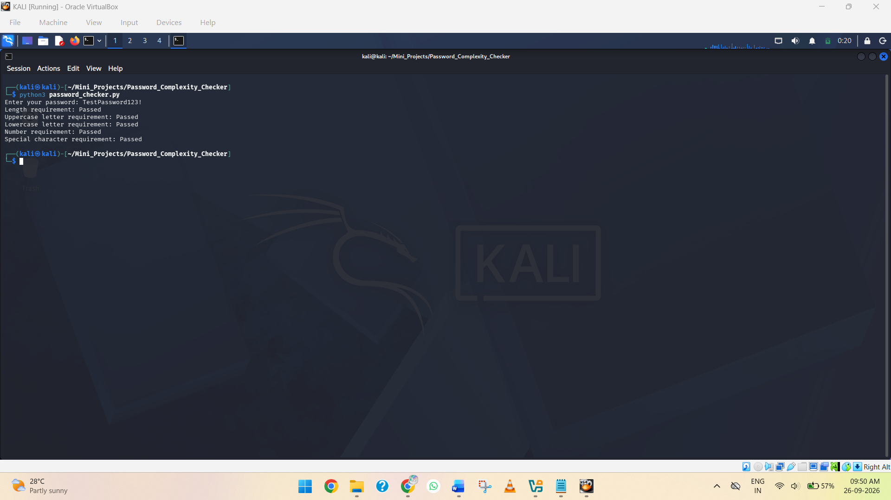
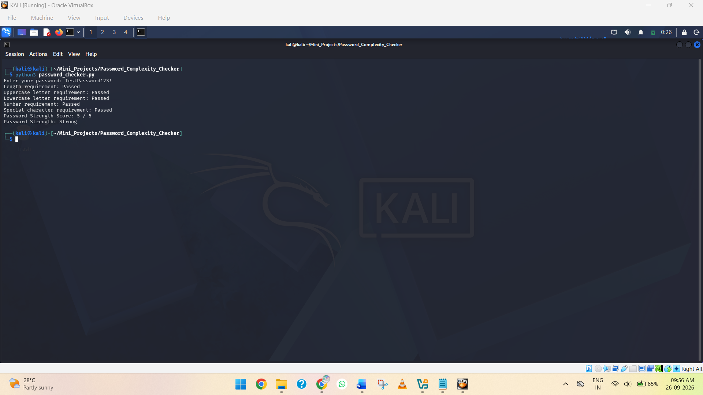
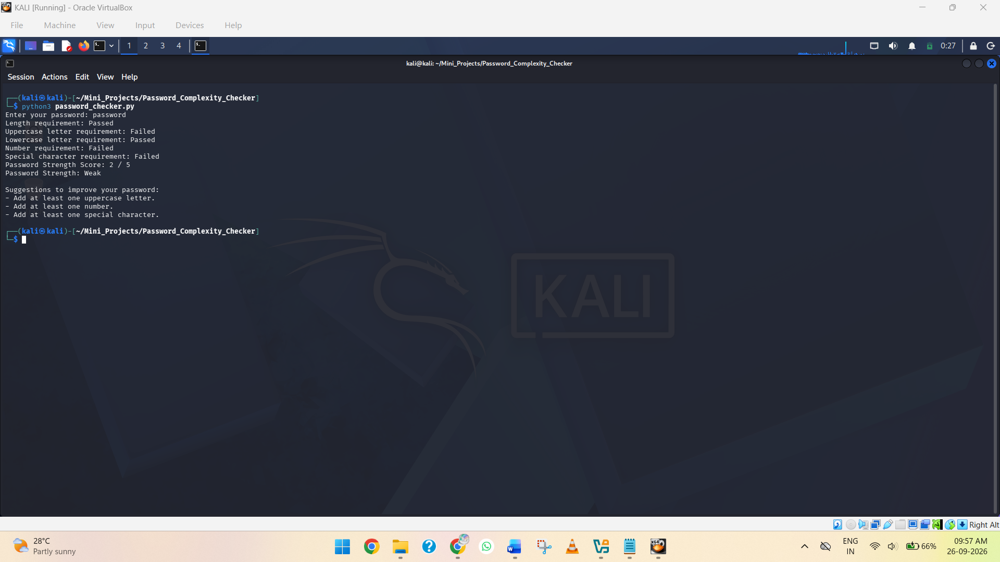
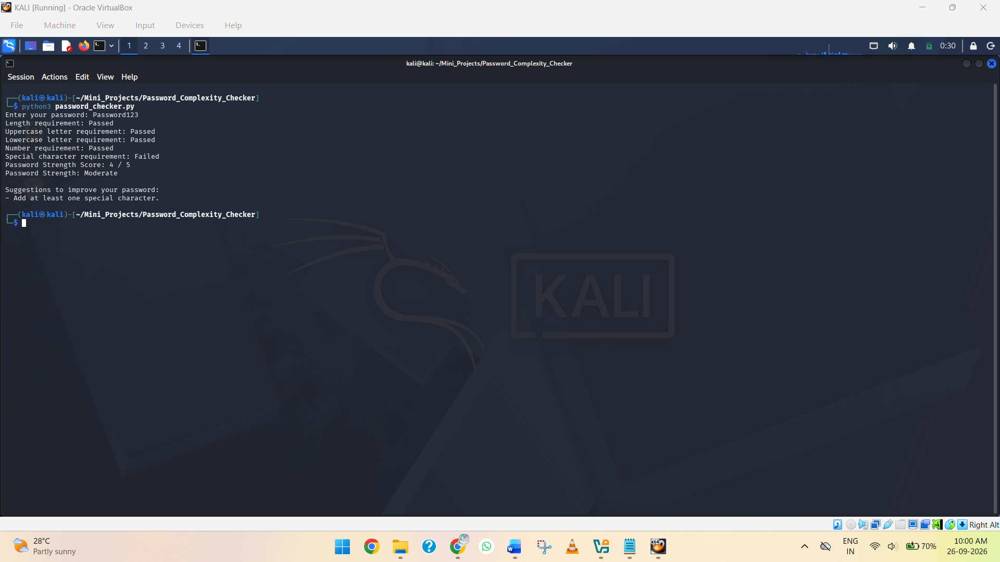
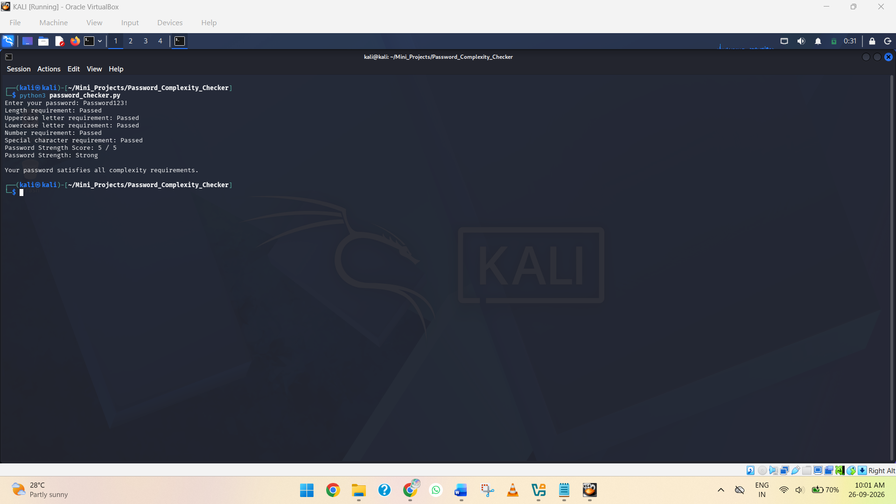

# Password Complexity Checker

## 📖 Project Overview

The **Password Complexity Checker** project is a Python-based application designed to evaluate the strength and complexity of a user-provided password. The program analyzes the password based on common security requirements such as length, uppercase letters, lowercase letters, numbers, and special characters.

The application checks the password against multiple complexity criteria and provides feedback about whether the password meets the required security conditions. It also helps identify missing character types so that users can understand how to improve their password strength.

This project demonstrates the practical use of **Python string handling, conditional statements, character validation, and basic cybersecurity concepts**. It provides a simple introduction to password security and the importance of creating strong and complex passwords.

## 🎯 Project Objective

The main objectives of this project are:

* To understand the basic concepts of password complexity and password security.
* To implement a password complexity checker using Python.
* To accept a password from the user instead of using a hard-coded password.
* To check whether the password contains at least 8 characters.
* To check for uppercase and lowercase letters.
* To check for numbers and special characters.
* To calculate a password strength score based on the satisfied requirements.
* To classify passwords as **Weak, Moderate, or Strong**.
* To provide feedback and suggestions when password requirements are not satisfied.
* To demonstrate a simple practical application of Python in cybersecurity.

## 🛠️ Tools and Technologies

| **Component**        | **Details**                                             |
| -------------------- | ------------------------------------------------------- |
| Programming Language | Python 3                                                |
| Operating System     | Kali Linux                                              |
| Environment          | VirtualBox                                              |
| Project Type         | Password Complexity Checker                             |
| Editor               | Nano Text Editor                                        |
| Terminal             | Kali Linux Terminal                                     |
| Password Criteria    | Length, Uppercase, Lowercase, Number, Special Character |
| Score System         | 0–5                                                     |

## ⚙️ Project Implementation

## Step 1 — Create the Project Directory

### Objective

Create a dedicated directory for the **Password Complexity Checker** project and navigate into it.

### 1. Open Kali Linux

Start the **Kali Linux virtual machine** in VirtualBox and log in to the system.


*Screenshot 1: Kali Linux running in VirtualBox.*

### 2. Open the Kali Linux Terminal

Run the following command:

```bash
mkdir Password_Complexity_Checker
```

This creates a new project directory in the current home directory.


*Screenshot 2: Showing the new folder created.*

### 3. Navigate into the Project Directory

Run:

```bash
cd Password_Complexity_Checker
ls
```

The `cd` command navigates into the newly created project directory, while the `ls` command displays its contents.

### 4. Verify the Current Directory

Run:

```bash
pwd
```

You should see a path similar to:

```text
/home/kali/Mini_Projects/Password_Complexity_Checker
```

The `pwd` command confirms the current working directory.


*Screenshot 3: Showing the current directory.*

## Step 2 — Create the Python File

### Objective

Create the Python source file that will contain the **Password Complexity Checker** program.

### 1. Navigate to the Project Directory

Make sure you are inside the **Password Complexity Checker** project directory.

### 2. Create the Python File

Run:

```bash
touch password_checker.py
```

This creates an empty Python file named `password_checker.py`.

### 3. Verify the Python File

Run:

```bash
ls
```

You should see:

```text
password_checker.py
```


*Screenshot 4: Terminal showing the creation of `password_checker.py` and the `ls` command displaying the newly created Python file.*

## Step 3 — Take Password Input from the User

### Objective

Modify the Python program to accept a password from the user instead of using a hard-coded password.

### 1. Open the Python File

From inside the project directory, run:

```bash
nano password_checker.py
```

### 2. Add the Following Code

Enter the following Python code:

```python
password = input("Enter your password: ")

print("Password received successfully.")
```

The `input()` function allows the user to enter a password through the terminal.



*Screenshot 5: Nano editor showing the Python code.*

### 3. Save the File

In Nano:

* Press **Ctrl + O** to save the file.
* Press **Enter** to confirm the filename.
* Press **Ctrl + X** to exit Nano.

### 4. Run the Python Program

Run:

```bash
python3 password_checker.py
```

The program will display:

```text
Enter your password:
```

Enter a test password, for example:

```text
TestPassword123!
```

You should then see:

```text
Password received successfully.
```


*Screenshot 6: Terminal showing the Python program asking the user to enter a password and displaying **“Password received successfully.”***

## Step 4 — Check Password Length

### Objective

Add a password length check to determine whether the entered password meets the minimum required length.

For this project, we will consider a password to meet the length requirement when it contains **at least 8 characters**.

### 1. Open the Python File

From inside the project directory, run:

```bash
nano password_checker.py
```

### 2. Replace the Existing Code

Replace the existing code with:

```python
password = input("Enter your password: ")

if len(password) >= 8:
    print("Length requirement: Passed")
else:
    print("Length requirement: Failed")
```

The `len()` function counts the number of characters in the password.

### 3. Save the File

In Nano:

* Press **Ctrl + O** to save the file.
* Press **Enter** to confirm the filename.
* Press **Ctrl + X** to exit Nano.

### 4. Run the Python Program

Run:

```bash
python3 password_checker.py
```

Test it with a password containing at least 8 characters:

```text
Enter your password: TestPassword123!

Length requirement: Passed
```


*Screenshot 7: Terminal showing the Password Complexity Checker accepting a password and displaying the **Length requirement: Passed** result.*

You can also test a shorter password:

```text
Enter your password: Test12

Length requirement: Failed
```


*Screenshot 8: Terminal showing the Password Complexity Checker rejecting a password and displaying the **Length requirement: Failed** result.*

Next, we will add checks for **uppercase and lowercase letters**.

## Step 5 — Check for Uppercase and Lowercase Letters

### Objective

Add checks to determine whether the password contains both **uppercase** and **lowercase letters**.

### 1. Open the Python File

From inside the project directory, run:

```bash id="qv5g9u"
nano password_checker.py
```

### 2. Replace the Existing Code

Replace the existing code with:

```python id="yq2z1r"
password = input("Enter your password: ")

if len(password) >= 8:
    print("Length requirement: Passed")
else:
    print("Length requirement: Failed")

if any(char.isupper() for char in password):
    print("Uppercase letter requirement: Passed")
else:
    print("Uppercase letter requirement: Failed")

if any(char.islower() for char in password):
    print("Lowercase letter requirement: Passed")
else:
    print("Lowercase letter requirement: Failed")
```

The `isupper()` function checks whether a character is an uppercase letter, while `islower()` checks whether a character is a lowercase letter. The `any()` function determines whether at least one matching character exists in the password.

### 3. Save the File

In Nano:

* Press **Ctrl + O** to save the file.
* Press **Enter** to confirm the filename.
* Press **Ctrl + X** to exit Nano.

### 4. Run the Python Program

Run:

```bash id="n5o6wl"
python3 password_checker.py
```

Test it with:

```text id="qg3z1m"
Enter your password: TestPassword

Length requirement: Passed
Uppercase letter requirement: Passed
Lowercase letter requirement: Passed
```


*Screenshot 9: Terminal showing the Password Complexity Checker testing a password and displaying the **length, uppercase, and lowercase requirements**.*

## Step 6 — Check for Numbers and Special Characters

### Objective

Add checks to determine whether the password contains at least one **number** and one **special character**.

### 1. Open the Python File

From inside the project directory, run:

```bash id="s0l8ec"
nano password_checker.py
```

### 2. Replace the Existing Code

Replace the existing code with:

```python id="r9rj6k"
password = input("Enter your password: ")

if len(password) >= 8:
    print("Length requirement: Passed")
else:
    print("Length requirement: Failed")

if any(char.isupper() for char in password):
    print("Uppercase letter requirement: Passed")
else:
    print("Uppercase letter requirement: Failed")

if any(char.islower() for char in password):
    print("Lowercase letter requirement: Passed")
else:
    print("Lowercase letter requirement: Failed")

if any(char.isdigit() for char in password):
    print("Number requirement: Passed")
else:
    print("Number requirement: Failed")

if any(not char.isalnum() for char in password):
    print("Special character requirement: Passed")
else:
    print("Special character requirement: Failed")
```

The `isdigit()` function checks for numbers. The `isalnum()` function identifies letters and numbers, so `not char.isalnum()` allows the program to detect special characters such as `!`, `@`, `#`, and `$`.

### 3. Save the File

In Nano:

* Press **Ctrl + O** to save the file.
* Press **Enter** to confirm the filename.
* Press **Ctrl + X** to exit Nano.

### 4. Run the Python Program

Run:

```bash id="4v6qrf"
python3 password_checker.py
```

Test it with:

```text id="c4qz9b"
Enter your password: TestPassword123!

Length requirement: Passed
Uppercase letter requirement: Passed
Lowercase letter requirement: Passed
Number requirement: Passed
Special character requirement: Passed
```



*Screenshot 10: Terminal showing the Password Complexity Checker testing a password and displaying the **length, uppercase, lowercase, number, and special character requirements**.*

## Step 7 — Calculate the Password Strength Score

### Objective

Combine the password complexity checks into a **strength score**. Each requirement that is successfully satisfied will add one point to the total score.

The five criteria are:

1. Minimum length of 8 characters
2. Uppercase letter
3. Lowercase letter
4. Number
5. Special character

### 1. Open the Python File

From inside the project directory, run:

```bash
nano password_checker.py
```

### 2. Replace the Existing Code

Replace the existing code with:

```python
password = input("Enter your password: ")

score = 0

if len(password) >= 8:
    print("Length requirement: Passed")
    score += 1
else:
    print("Length requirement: Failed")

if any(char.isupper() for char in password):
    print("Uppercase letter requirement: Passed")
    score += 1
else:
    print("Uppercase letter requirement: Failed")

if any(char.islower() for char in password):
    print("Lowercase letter requirement: Passed")
    score += 1
else:
    print("Lowercase letter requirement: Failed")

if any(char.isdigit() for char in password):
    print("Number requirement: Passed")
    score += 1
else:
    print("Number requirement: Failed")

if any(not char.isalnum() for char in password):
    print("Special character requirement: Passed")
    score += 1
else:
    print("Special character requirement: Failed")

print("Password Strength Score:", score, "/ 5")
```

### 3. Save the File

In Nano:

* Press **Ctrl + O** to save the file.
* Press **Enter** to confirm the filename.
* Press **Ctrl + X** to exit Nano.

### 4. Run the Python Program

Run:

```bash
python3 password_checker.py
```

Test it with:

```text
Enter your password: TestPassword123!

Length requirement: Passed
Uppercase letter requirement: Passed
Lowercase letter requirement: Passed
Number requirement: Passed
Special character requirement: Passed
Password Strength Score: 5 / 5
```

The `score` variable starts at `0`. Each time a password requirement is satisfied, `score += 1` increases the score by one.


*Screenshot 11: Terminal showing the Password Complexity Checker testing a password and displaying the individual requirements along with the final **Password Strength Score: 5 / 5**.*

## Step 8 — Determine the Password Strength

### Objective

Use the password strength score to classify the password as **Weak, Moderate, or Strong**.

### 1. Open the Python File

From inside the project directory, run:

```bash id="p4r5qk"
nano password_checker.py
```

### 2. Add the Following Code

Add the following code at the end of the existing program:

```python id="0q8s8d"
if score <= 2:
    print("Password Strength: Weak")

elif score <= 4:
    print("Password Strength: Moderate")

else:
    print("Password Strength: Strong")
```

The classification is based on the following score ranges:

| Score | Strength |
| ----- | -------- |
| 0–2   | Weak     |
| 3–4   | Moderate |
| 5     | Strong   |

### 3. Save the File

In Nano:

* Press **Ctrl + O** to save the file.
* Press **Enter** to confirm the filename.
* Press **Ctrl + X** to exit Nano.

### 4. Run the Program

Run:

```bash id="8j3j0m"
python3 password_checker.py
```

For example:

```text id="d3w0kx"
Enter your password: TestPassword123!

Length requirement: Passed
Uppercase letter requirement: Passed
Lowercase letter requirement: Passed
Number requirement: Passed
Special character requirement: Passed

Password Strength Score: 5 / 5
Password Strength: Strong
```



*Screenshot 12: Terminal showing the password requirements, the final strength score, and the **Password Strength: Strong** result.*

Next, we will add **feedback explaining which requirements are missing** when a password does not meet all the criteria.

## Step 9 — Provide Feedback for Weak Passwords

### Objective

Improve the Password Complexity Checker by providing specific feedback when a password does not satisfy one or more security requirements.

Instead of only displaying the score, the program will tell the user what needs to be improved.

### 1. Open the Python File

From inside the project directory, run:

```bash id="j6q1ye"
nano password_checker.py
```

### 2. Replace the Existing Code

Replace the existing code with the following:

```python id="f5g7q3"
password = input("Enter your password: ")

score = 0
feedback = []

if len(password) >= 8:
    print("Length requirement: Passed")
    score += 1
else:
    print("Length requirement: Failed")
    feedback.append("Use at least 8 characters.")

if any(char.isupper() for char in password):
    print("Uppercase letter requirement: Passed")
    score += 1
else:
    print("Uppercase letter requirement: Failed")
    feedback.append("Add at least one uppercase letter.")

if any(char.islower() for char in password):
    print("Lowercase letter requirement: Passed")
    score += 1
else:
    print("Lowercase letter requirement: Failed")
    feedback.append("Add at least one lowercase letter.")

if any(char.isdigit() for char in password):
    print("Number requirement: Passed")
    score += 1
else:
    print("Number requirement: Failed")
    feedback.append("Add at least one number.")

if any(not char.isalnum() for char in password):
    print("Special character requirement: Passed")
    score += 1
else:
    print("Special character requirement: Failed")
    feedback.append("Add at least one special character.")

print("Password Strength Score:", score, "/ 5")

if score <= 2:
    print("Password Strength: Weak")

elif score <= 4:
    print("Password Strength: Moderate")

else:
    print("Password Strength: Strong")

if feedback:
    print("\nSuggestions to improve your password:")

    for suggestion in feedback:
        print("-", suggestion)

else:
    print("\nYour password satisfies all complexity requirements.")
```

The `feedback` list stores suggestions for each requirement that the password does not satisfy. The `append()` function adds an appropriate suggestion to the list.

### 3. Save the File

In Nano:

* Press **Ctrl + O** to save the file.
* Press **Enter** to confirm the filename.
* Press **Ctrl + X** to exit Nano.

### 4. Run the Program

Run:

```bash id="rj3j9x"
python3 password_checker.py
```

Test the program with a weak password such as:

```text id="xj4c8f"
Enter your password: password
```

You should see feedback similar to:

```text id="7qf2h5"
Length requirement: Passed
Uppercase letter requirement: Failed
Lowercase letter requirement: Passed
Number requirement: Failed
Special character requirement: Failed

Password Strength Score: 2 / 5
Password Strength: Weak

Suggestions to improve your password:
- Add at least one uppercase letter.
- Add at least one number.
- Add at least one special character.
```



*Screenshot 13: Terminal showing a weak password being tested, the strength score, password classification, and suggestions for improving the password.*

## Step 10 — Test the Password Complexity Checker

### Objective

Test the completed program with different types of passwords to verify that the complexity checks, score calculation, strength classification, and feedback work correctly.

### 1. Run the Python Program

From inside the project directory, run:

```bash
python3 password_checker.py
```

### 2. Test a Weak Password

Enter:

```text
password
```

The program should identify the missing requirements and classify the password based on the calculated score.


*Screenshot 14: Terminal showing the completed Password Complexity Checker being tested with a weak password and displaying a **2 / 5** score and the displayed password classification.*

### 3. Test a Moderate Password

Run the program again:

```bash
python3 password_checker.py
```

Enter:

```text
Password123
```

This password satisfies the length, uppercase, lowercase, and number requirements while missing the special character requirement.

The expected result should be similar to:

```text
Password Strength Score: 4 / 5
Password Strength: Moderate
```



*Screenshot 15: Terminal showing the completed Password Complexity Checker being tested with a moderate password and displaying a **4 / 5** score and the displayed password classification.*

### 4. Test a Strong Password

Run the program again:

```bash
python3 password_checker.py
```

Enter:

```text
Password123!
```

The expected result should be:

```text
Password Strength Score: 5 / 5
Password Strength: Strong
```



*Screenshot 16: Terminal showing the completed Password Complexity Checker being tested with a strong password and displaying a **5 / 5** score and the **Password Strength: Strong** result.*

✅ Conclusion

The **Password Complexity Checker** project successfully demonstrates how Python can be used to evaluate password complexity based on multiple security requirements. The program checks for a minimum password length, uppercase letters, lowercase letters, numbers, and special characters.

The project also calculates a **Password Strength Score** out of 5, classifies the password based on the score, and provides suggestions when one or more requirements are not satisfied. Testing the program with different passwords helped verify the functionality of the complexity checks, scoring system, classification, and feedback mechanism.

Through this project, practical knowledge was gained in **Python programming, string handling, conditional statements, loops, functions such as `isupper()`, `islower()`, `isdigit()`, and `isalnum()`, list handling, and basic password security concepts**. The project provides a simple practical understanding of how password complexity requirements can be implemented programmatically.
